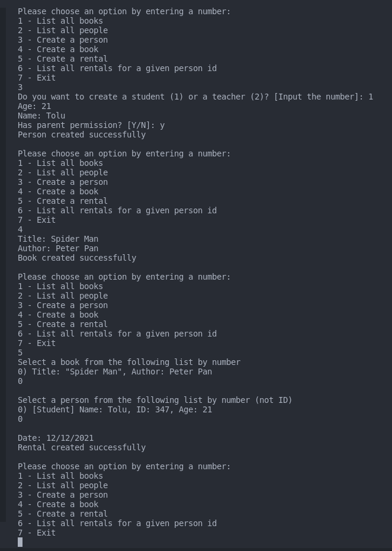

# School Library

> A Ruby School Library Application that allows you to add students, teachers and books. Save records of who borrowed a given book.

## Project Image

## Built With

- Ruby

## To get a local copy run the following steps:
- Copy this link [this link](https://github.com/Whoistolu/School-Library)
- Open your terminal or command line
- Run "git clone Paste [this link](https://github.com/Whoistolu/School-Library)"
- Open the folder with your code editor
- Create a branch to work on
- Or open the `student.rb`, `person.rb`, `teacher.rb` file in the dist directory to start coding

👤 **Author**

- Name: Ajise Toluwase
- GitHub: [@githubhandle](https://github.com/Whoistolu)
- Twitter: [@twitterhandle](https://twitter.com/Littletolu)
- LinkedIn: [LinkedIn](https://www.linkedin.com/in/toluwase-ajise-9b40411b2/)

## 🤝 Contributing

Contributions, issues, and feature requests are welcome!

Feel free to check the [issues page](https://github.com/Whoistolu/School-Library/issues).

## Acknowledgements

## Show your support

Give a ⭐️ if you like this project!
